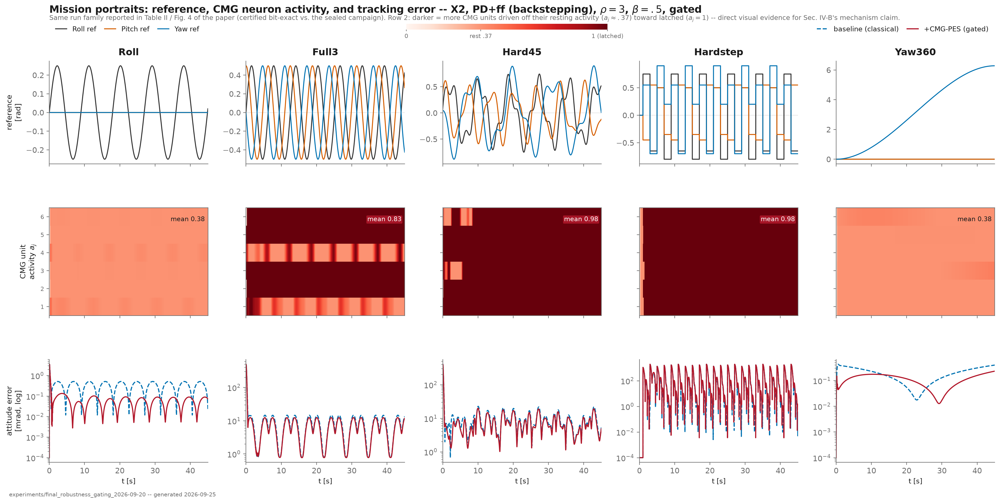
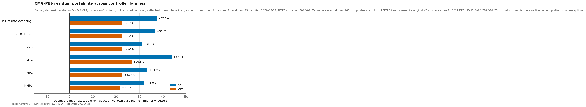

# CMG-PES Attitude Residual — Bounded Neuromorphic Control for Quadrotor Attitude Tracking

Six continuous coupled membrane-gate (CMG) units and an 18-weight online PES decoder form a bounded,
saturation-aware residual that augments a classical attitude controller — with exact recovery of the
baseline when disabled, and no change to the plant, sensing, or actuator interface.

> **Status:** Private (pre-publication). Submitted to the 2027 American Control Conference (ACC).
> The library here is complete and runnable; the full experiment/reproduction package (campaign
> scripts, pre-registration, certification reports) will be added upon acceptance. See
> [Citation](#citation).

## Overview

The residual reduces geometric-mean quaternion attitude-tracking error by 37.3% (Skydio X2) and 22.4%
(Crazyflie 2) over a bandwidth-tuned PD+feedforward baseline in MuJoCo simulation, with an explicit,
provable bound on its deviation from the baseline command and exact recovery of the baseline at zero
residual authority. The same bounded interface attaches without modification to five classical control
families beyond PD — LQR, backstepping, sliding-mode control, unconstrained MPC, and nonlinear MPC —
improving tracking for every family and platform tested, with no per-family retuning.


*What's commanded, how hard the six CMG units work, and the tracking-error payoff, per mission. Neuron
activity sits near its resting value (~0.37) on gentle missions and saturates (latches to 1) on
demanding ones — direct evidence for the paper's own mechanism claim, not just an assertion.*


*The same bounded, gated residual attached to PD, PID, LQR, SMC, MPC, and NMPC baselines — every family
improves, on both platforms, with no per-family retuning.*

## Repository structure

```
.
├── Readme.md
├── CITATION.cff
├── requirements.txt
├── figures/                 # result figures shown above
└── gra_control/             # core library
    ├── math3d.py            # quaternion kinematics, shortest-path attitude error
    ├── gate.py               # the CMG-PES residual: encoding, PES decoder, saturation-aware gate
    └── platforms/            # X2 / CF2 model interfaces, torque limits, rotor allocation
```

## Requirements

- Python 3.11+
- NumPy 2.5.2, MuJoCo 3.12.0 (pinned in `requirements.txt`)

The library here is pure NumPy + MuJoCo — no neuromorphic-simulator dependency to read or run it. Nengo
enters only in the fuller experiment pipeline (the paper's neuron-family comparison, Amendment A4),
which ships with the rest of the reproduction package upon acceptance.

## Usage / Reproducing results

The library (`gra_control`) implements the residual architecture and is directly importable. The
campaign scripts, pre-registration record, and the certification reports documenting every headline
number in the paper will be added here once the paper is accepted — this keeps the public release tied
to the reviewed, final version rather than an in-progress one.

## Data

Simulation-generated (MuJoCo); no external dataset. Run archives and the pre-registered analysis
scripts will be released alongside the full code upon acceptance.

## Citation

If you use this code, please cite the associated paper (see `CITATION.cff`); the BibTeX entry will be
added once the paper has a DOI.

## License

MIT — see the repository root [`LICENSE`](../../LICENSE).

## Contact

TODO: Name / email / lab / ORCID.
